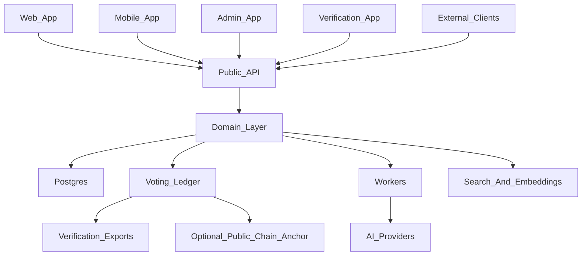

# Govnr Architecture Spec

## Intent

Govnr is civic infrastructure for direct democracy at any scale: from small clubs and community groups through enterprises, institutions, cities, countries, and eventually global-scale deliberation.

The system should make democratic participation accessible while preserving the properties expected of serious civic infrastructure:

- Equal political power by default: one eligible member, one vote.
- Transparent rules for membership, proposal creation, voting, thresholds, and outcomes.
- Verifiable records of important civic actions.
- AI assistance for understanding, drafting, summarising, researching, and comparing civic material.
- Architecture that can start simply but grow toward high-trust, high-scale deployments.

The existing Rails application should be treated as a domain reference rather than the technical foundation. Its core concepts remain valuable: groups, petitions, motions, drafts, statutes, comments, activity, membership, and votes.

## Recommended System Shape

Govnr should be structured around a stable core API and domain layer, with multiple applications consuming it.



The first implementation should be a service-ready modular architecture, not a large set of independently deployed microservices on day one. The code should be organized so that the voting ledger, AI workers, and public API can be separated later when operational, security, or scaling requirements justify it.

## Recommended Technology Stack

### Core API

Recommended starting point:

- TypeScript.
- Node.js.
- NestJS for the public API and application-service layer.
- PostgreSQL as the primary database.
- Drizzle or Prisma for persistence, with a preference for Drizzle if explicit SQL control is valued.
- OpenAPI generated from the API contract, or GraphQL if the client-query needs become complex.
- Zod, Valibot, or framework-native DTO validation for strict request boundaries.

NestJS is a good fit because the product wants explicit modules, clear dependency boundaries, testable services, and a long-lived API surface. Fastify is also a credible alternative if the project prefers a smaller framework and more hand-rolled structure.

### Web Application

The web app should be a separate client of the API, not the backend itself.

Recommended starting point:

- React with Vite or React Router.
- TanStack Query for API state.
- Generated API client from the core API contract.
- Design system built as a separate package once UI patterns stabilise.

Next.js can still be used for the web app if server rendering becomes important, but the core backend should not live inside Next.js routes or server actions.

### Persistence and Infrastructure

Recommended starting point:

- PostgreSQL for relational civic data.
- Redis for queues, cache, rate limiting, and ephemeral workflow state.
- BullMQ, Inngest, Trigger.dev, or Temporal for background jobs. Start with BullMQ or Inngest unless long-running workflows become central.
- Object storage for files and attachments.
- Postgres full-text search plus embeddings initially. Add OpenSearch, Meilisearch, or another search service only when product needs justify it.

### AI Layer

AI should be assistive, auditable, and provider-agnostic.

Initial capabilities:

- Summarise discussions, motions, drafts, and arguments.
- Compare versions of drafts and statutes.
- Help users draft petitions, motions, amendments, and explanatory notes.
- Provide in-app research assistance with source citations.
- Generate neutral summaries and pro/con briefs.

Important constraints:

- AI outputs should never silently alter civic records.
- AI-generated content should be labelled.
- Prompts, model choices, source material, and generated outputs should be logged for auditability where appropriate.
- The system should support multiple providers rather than coupling the domain to one AI vendor.

## Voting Security and Ledger

The first serious implementation should use a tamper-evident append-only ledger rather than a full custom blockchain.

The ledger should:

- Record canonical voting and civic events.
- Hash each event.
- Link each event to the previous event hash.
- Group election or motion events into Merkle trees.
- Produce public verification bundles for completed votes.
- Support independent verification of vote inclusion and result calculation.
- Optionally anchor periodic ledger roots to a public blockchain for external timestamping.

This provides strong integrity guarantees without prematurely taking on validator networks, consensus protocols, forks, node operations, and chain governance.

The ledger can later evolve into a permissioned chain if groups or institutions need independently operated nodes.

## Domain Modules

The core domain should be organized around these modules:

- Identity and authentication.
- Organizations, groups, and spaces.
- Membership and eligibility.
- Roles and permissions.
- Petitions and proposal intake.
- Motions and voting lifecycle.
- Voting rules, thresholds, quorum, and schedules.
- Drafts, amendments, and version history.
- Statutes, decisions, and civic records.
- Deliberation: comments, arguments, annotations, and moderation.
- Activity feeds and notifications.
- Search, discovery, and tagging.
- AI assistance and research.
- Audit events and ledger verification.

## Recommended GitHub Structure

Use a GitHub organization, for example `govnr`, with this repository as the core platform/API repository.

### Repositories

#### `govnr`

Purpose: core API, domain model, ledger subsystem, workers, database schema, and infrastructure contracts.

This should be the main repository and the source of truth for civic rules.

Suggested structure:

```text
govnr/
  api/
    contracts/
    http/
  application/
    ports/
    use-cases/
  domain/
    entities/
    events/
    policies/
    value-objects/
  infrastructure/
    ai/
    auth/
    ledger/
    persistence/
    queue/
    workers/
  config/
  documentation/
    specifications/
    security/
  legacy/
    rails-reference/
```

The existing Rails code is preserved under `legacy/rails-reference` as a domain reference during discovery.

Deployment and operational infrastructure should live in the separate `govnr-ops` repository so it is not confused with the core clean-architecture `infrastructure` adapter layer.

#### `govnr-web`

Purpose: main public web client.

This should consume the core API as an external client. It should not contain privileged business logic.

Suggested stack:

- React with Vite or React Router.
- Generated API client from `govnr`.
- Shared design system package if and when needed.

#### `govnr-admin`

Purpose: contained platform administration and operations interface.

This should be separate from the main civic web app. Group-level administration can live in `govnr-web`, but platform-level administration should be isolated for stricter access control and operational focus.

Likely responsibilities:

- Platform operator access.
- Deployment and environment management views.
- Institutional onboarding.
- Moderation oversight.
- Audit and support tooling.
- Operational health dashboards.

#### `govnr-ops`

Purpose: operational tooling, deployment configuration, environment management, runbooks, and observability.

This repository is separate from the core `govnr` repo to avoid confusion with the core clean-architecture `infrastructure` layer. It should own Docker Compose, container definitions, Terraform, environment templates, deployment automation, runbooks, and monitoring configuration.

#### `govnr-verify`

Purpose: public verification tool for voting records and ledger proofs.

This should likely become its own small, static-first app. It benefits from being independently deployable and easy for third parties to inspect.

#### `govnr-mobile`

Purpose: mobile client.

Create this only when there is a real mobile product commitment. Until then, keep the API mobile-ready but avoid maintaining a placeholder app.

#### `govnr-sdk`

Purpose: generated clients and integration SDKs.

Do not create this manually at first. Generate clients from the API contract inside `govnr`, then publish an SDK package or split a repo once external integrations need stable versioning.

#### `govnr-docs`

Purpose: public documentation, civic model explanations, developer docs, and verification guides.

This can start as `/docs` in the core repo. Split it out if documentation becomes a public site with its own editorial workflow.

## Submodules

Avoid Git submodules for the main product architecture.

Submodules add operational friction, complicate onboarding, and often make coordinated changes harder. They are rarely the right default for product code.

Use submodules only for:

- Frozen third-party protocol specs.
- External cryptography test vectors.
- Archival snapshots that should not be edited as normal source.

Prefer these alternatives:

- Monorepo packages for tightly coupled core code.
- Separate repos for separately deployed applications.
- Published packages for stable SDKs and shared libraries.
- GitHub Actions and package versioning for release boundaries.

## Workspace Recommendation

For local development, use a parent workspace directory containing sibling repos:

```text
govnr-workspace/
  govnr/
  govnr-web/
  govnr-verify/
  govnr-admin/
  govnr-mobile/
  govnr-docs/
```

The `govnr` repo should run the core platform locally with Docker Compose:

```text
Postgres
Redis
API
Worker
Ledger worker
Optional local object storage
```

Client apps should point at the local API through environment variables, for example `GOVNR_API_URL=http://localhost:3000`.

## Boundary Principles

- The API owns civic rules.
- Client apps present workflows but do not decide eligibility, voting outcomes, or ledger state.
- The domain layer should not depend on HTTP, UI, or provider-specific AI SDKs.
- The ledger should be append-only and independently verifiable.
- AI should assist users and moderators, not become an invisible decision-maker.
- Strong auditability matters more than clever infrastructure.
- Split services only when the boundary has a real security, scaling, or operational reason.

## First Milestone

The first milestone should specify and prototype the civic lifecycle:


Minimum deliverables:

- Create groups.
- Invite or approve members.
- Create petitions.
- Promote successful petitions into motions.
- Vote on motions.
- Record votes in a tamper-evident ledger.
- Finalise results according to group rules.
- Export a verification proof for a completed motion.
- Use AI to summarise a motion and discussion without altering the official record.

